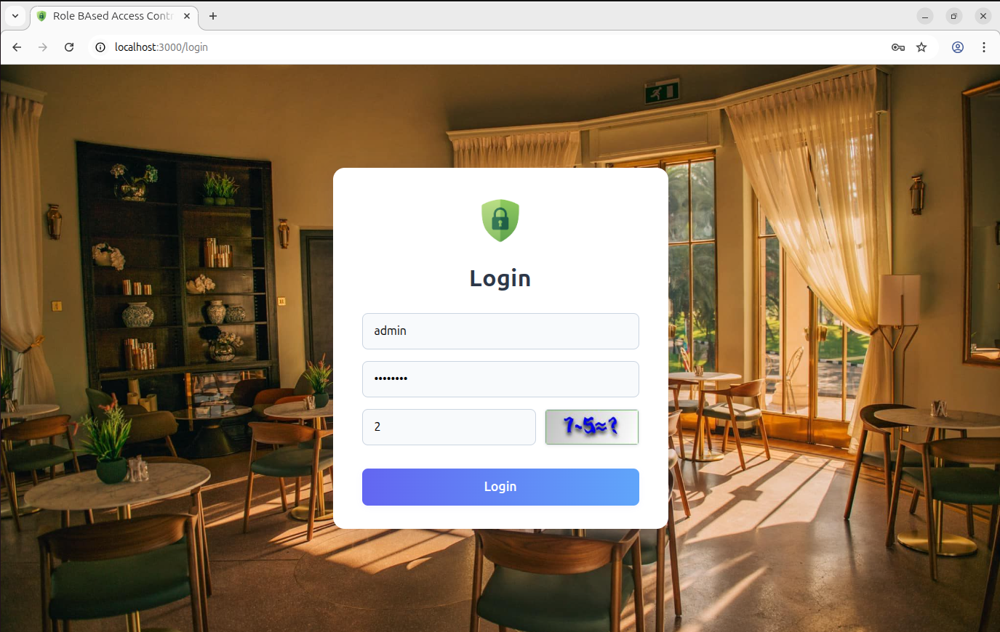
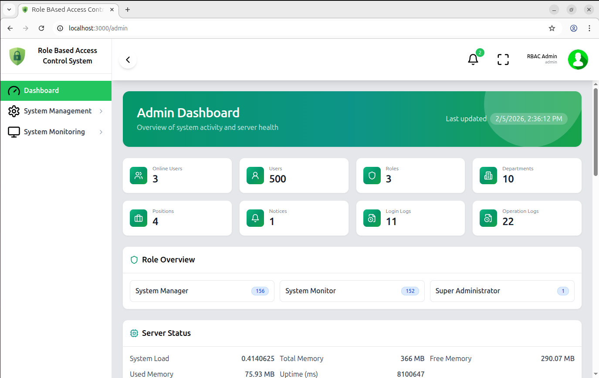
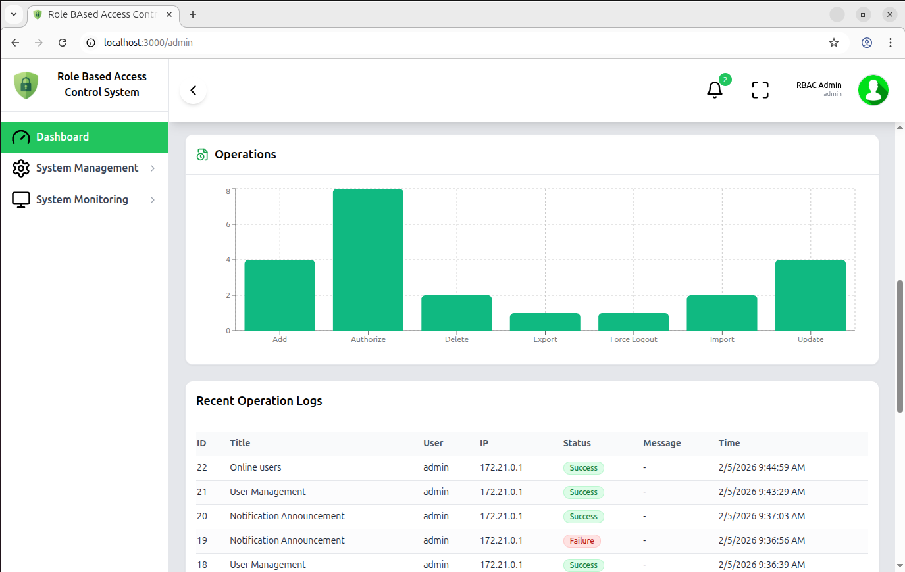
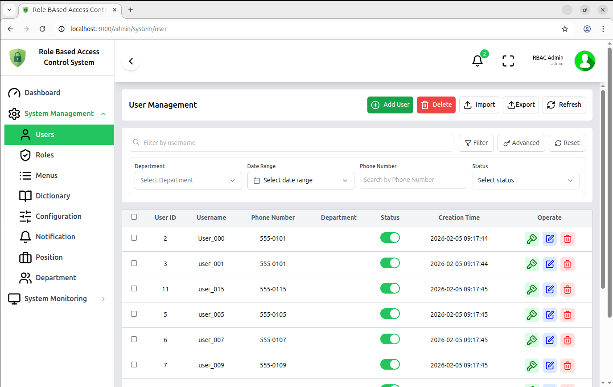
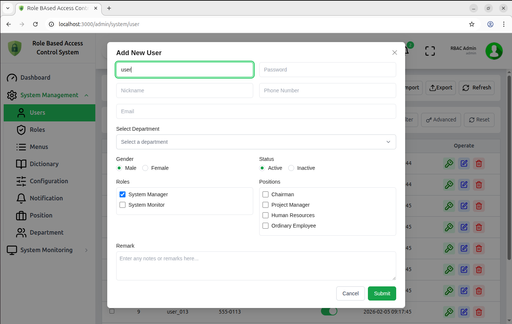
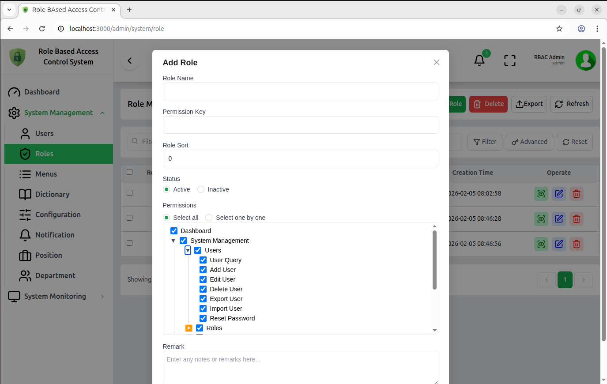
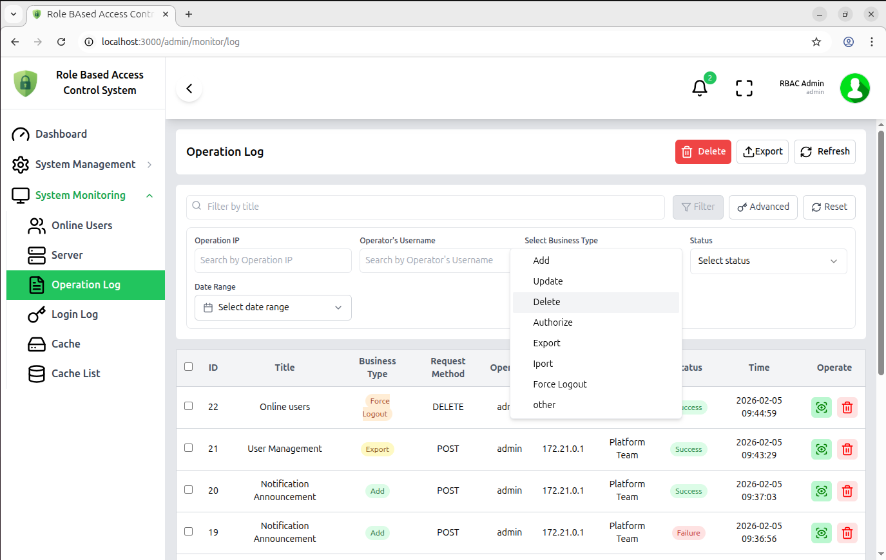
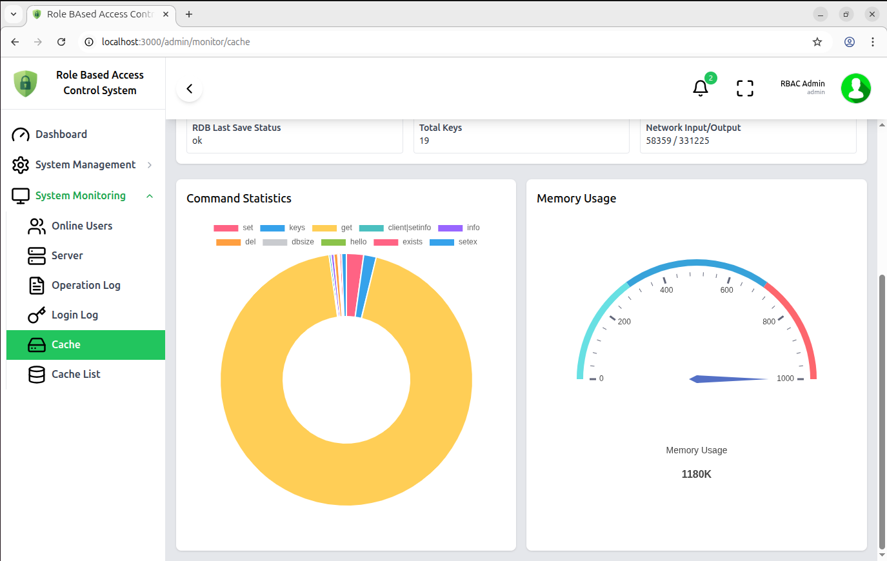
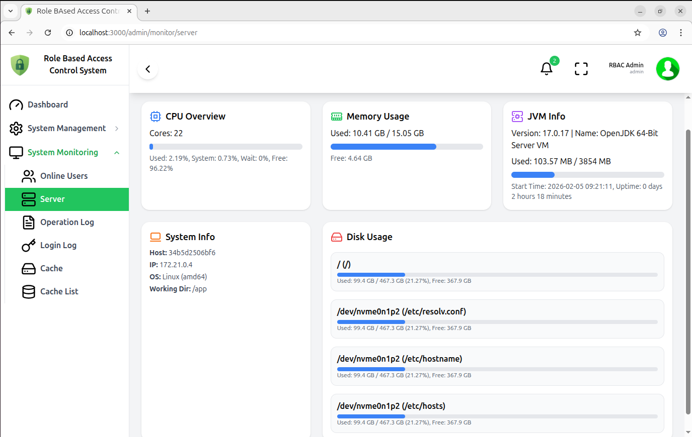
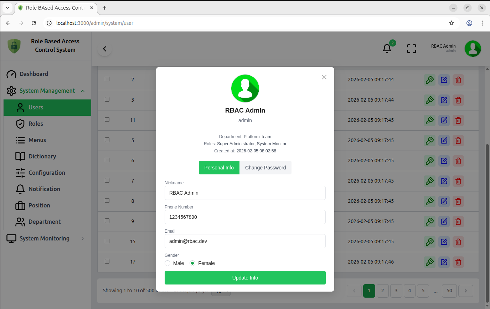

# RBAC (Role-Based Access Control)

Comprehensive Role-Based Access Control (RBAC) reference implementation with a Spring Boot backend and a React + Vite frontend. This repository contains two main projects:

- `rbac-backend-main/` — Java Spring Boot backend (Gradle).
- `rbac-frontend-main/` — React + TypeScript frontend (Vite).

Repository mirrors on GitHub:

- Backend: https://github.com/adrianleul/rbac-backend.git
- Frontend: https://github.com/adrianleul/rbac-frontend.git

**Status:** Ready for local development and Docker-based deployment.

----

## Table of Contents

- Project Overview
- Tech Stack
- Repository Structure
- Backend Structure (backend module)
- Frontend Structure (frontend module)
- Prerequisites
- Quick Start (local)
- Docker (compose)
- Environment & Configuration
- Running Tests & Linting
- Contributing
- License

----

## Project Overview

This repository provides a full-stack example of an RBAC system with features such as user management, roles, permissions, menus, and audit logs. It is intended as a starter kit for enterprise-style permissioned applications.

## Tech Stack

- Backend: Java, Spring Boot, Gradle. Postgres, Redis, JWT
- Frontend: React, TypeScript, Vite, Redux, Tailwind CSS
- DevOps: Docker, docker-compose

## Repository Structure

- `rbac-backend-main/` — Backend source, Gradle wrapper, Dockerfile
  - `src/main/java/` — Java source packages
  - `src/main/resources/` — application properties and DB scripts
- `rbac-frontend-main/` — Frontend source, Vite config, Dockerfile
  - `src/` — React app source
  - `Public/` — static assets
- `docker-compose.yml` — Orchestrates backend and frontend containers

## Backend Structure (backend module)

Backend lives in `rbac-backend-main/` and follows a fairly standard layered Spring Boot + MyBatis layout.

### Entry point

- `src/main/java/com/rbac/rbacApplication.java` — Spring Boot main class.

### Main packages (`src/main/java/com/rbac/`)

- `controller/` — REST API layer (request/response, validation, calling services)
  - `controller/system/` — Core RBAC/business endpoints (users, roles, menus, depts, config, auth, etc.)
  - `controller/monitor/` — Monitoring/auditing endpoints (server info, cache, login info, online users, oper logs)
  - `controller/common/` — Shared endpoints (e.g., captcha, file/common utilities)
  - `controller/tool/` — Tooling/test endpoints

- `system/` — “System” domain module
  - `system/domain/` — Domain models used by the system module (e.g., `SysUser`, `SysRole*`, `SysOperLog`, etc.)
  - `system/mapper/` — MyBatis mapper interfaces (`*Mapper.java`)
  - `system/service/` — Service interfaces (`I*Service.java`)
  - `system/service/impl/` — Service implementations (`*ServiceImpl.java`)

- `framework/` — Cross-cutting infrastructure
  - `framework/config/` — Spring configuration (Security, Redis, MyBatis, Druid, CORS/resources, thread pools, i18n, etc.)
  - `framework/security/` — JWT/security plumbing (auth filters, contexts, handlers)
  - `framework/web/` — Web helpers (global exception handler, auth/token services, permission services, server info DTOs)
  - `framework/aspectj/` — AOP aspects (logging, data scope, rate limiting, datasource switching)
  - `framework/datasource/` — Dynamic datasource helpers
  - `framework/interceptor/` — Request interceptors (repeat submit, etc.)
  - `framework/manager/` — Async task manager/factory

- `common/` — Shared primitives used across layers
  - `common/core/` — Base controller, common response objects, base entities, DTOs, pagination helpers
  - `common/annotation/` — Custom annotations (logging, data scope, rate limiting, anonymous, etc.)
  - `common/exception/` — Custom exceptions
  - `common/constant/`, `common/enums/` — Constants/enums used throughout the app
  - `common/utils/` — Utility classes (dates, strings, servlet/http helpers, security helpers, etc.)
  - `common/filter/` and `common/xss/` — Request wrappers/filters and XSS protection utilities

- `config/` — Standalone configuration like Swagger/OpenAPI config.

### Resources (`src/main/resources/`)

- `application.properties` — Base Spring Boot configuration (ports, datasource, Redis, JWT, MyBatis)
- `application-druid.properties` — Druid-specific profile configuration (when `spring.profiles.active=druid`)
- `db/migration/` — Flyway migrations (e.g., `V1__init_sys.sql` initializes schema and seed data)
- `mapper/` — MyBatis mapper XML files (SQL statements), organized by module (e.g., `mapper/system/*Mapper.xml`)
- `mybatis/` — MyBatis configuration (e.g., `mybatis-config.xml`)
- `i18n/` — Message bundles for internationalization (`spring.messages.basename=i18n/messages`)

### Request flow (high level)

HTTP request → `controller/*` → `system/service/*` → `system/mapper/*` (+ `resources/mapper/**/*.xml`) → DB.
Security is enforced via `framework/security/*` (JWT filter + permission checks), and failures are translated by `framework/web/exception/GlobalExceptionHandler`.

## Frontend Structure (frontend module)

Frontend lives in `rbac-frontend-main/` and is a React + TypeScript application built with Vite. It’s organized around routing, Redux state slices, and a small API client layer.

### Entry point & app shell

- `src/main.tsx` — Bootstraps React, wires `react-redux` `Provider`, `react-router-dom` `BrowserRouter`, language provider, and toast provider.
- `src/App.tsx` — Small shell component that renders the route tree.
- `src/index.css` + `tailwind.config.js` — Global styles and Tailwind setup.

### Routing & permission gating

- `src/routes/Router.tsx` — Builds the final route tree using `useRoutes`.
- `src/routes/constantRoutes.tsx` — Public/static routes (e.g., login, not-found).
- `src/routes/dynamicRoutes.tsx` — Feature routes that can be protected.
- `src/routes/privateRoute.tsx` — Route guard that checks user roles/permissions from Redux and redirects/blocks as needed.

High level: route definitions can carry `roles`/`permissions`, and `Router.tsx` wraps those routes with `PrivateRoute` based on the current authenticated user state.

### State management (Redux Toolkit)

- `src/store.ts` — Configures the Redux store.
- `src/features/*` — Slice-based state (e.g., `user`, `menu`, `dict`, `app`).

State persistence uses `redux-persist` (notably for `user` and `menu`) so auth/menu state survives page refresh.

### API layer & HTTP client

- `src/api/**` — Thin, feature-scoped API modules grouped by backend area:
  - `api/auth/*` — Login/menu/auth endpoints
  - `api/system/*` — System/RBAC endpoints (users, roles, depts, config, etc.)
  - `api/monitor/*` — Monitoring/audit endpoints
  - `api/dict/*` — Dictionary endpoints

- `src/utils/request.ts` — Axios instance + interceptors:
  - Attaches JWT token to `Authorization: Bearer <token>`
  - Normalizes GET query params
  - Prevents duplicate POST/PUT submissions
  - Centralizes error handling (401 triggers logout + redirect to `/login`)
  - Provides a `download()` helper for binary responses

### UI building blocks

- `src/components/` — Reusable components (tables, pagination, sidebar, progress, inputs)
  - `components/ui/` — Low-level UI primitives (buttons, inputs, dialogs, etc.)
  - `components/modal/` — App modals (confirm/delete/status/import/icon select)
  - `components/alert/` — Toast/notification system

### Pages, layouts, and views

- `src/layout/` — Page layouts (navbar/sidebar layout, login layout, admin sections)
- `src/views/` — Route-level pages (e.g., `NotFound`, `Unauthorized`, feature views)

### Shared utilities & types

- `src/utils/` — Auth token helpers, permission helpers, config helpers, validation, className helpers, error codes.
- `src/types/` — Shared TypeScript types.
- `src/contexts/` and `src/lib/` — Cross-app providers and hooks (language/i18n, theme, translations).
- `src/plugins/` — Small plugin utilities (e.g., caching wrapper).

### Configuration & deployment files

- `env.ts` + `.env.*` — Environment-driven settings (API base URL, etc.).
- `vite.config.ts` — Vite build/dev server config.
- `Dockerfile` + `nginx.conf` — Container build and Nginx config for serving the built frontend.

### Request flow (high level)

UI action → `src/api/*` call → `src/utils/request.ts` (Axios interceptors + token) → backend REST API → response updates Redux slices → routes/components re-render.

## Prerequisites

- Docker & docker-compose (recommended)
- JDK 17+ (if running backend locally without Docker)
- Node.js 16+ and npm/yarn (if running frontend locally)

## Quick Start — Local (development)

1. Backend (local):

```bash
cd rbac-backend-main
./gradlew bootRun
# or build and run the jar
./gradlew build
java -jar build/libs/*-SNAPSHOT.jar
```

2. Frontend (local):

```bash
cd rbac-frontend-main
npm install
npm run dev
# open http://localhost:5173 (or printed Vite URL)
```

Notes:
- Backend default port is typically `8080` (verify in `rbac-backend-main/src/main/resources/application.properties`).
- Frontend Vite default port is `5173`.

Default credentials (initial):

- Username: `admin`
- Password: `admin123`

For security, change these credentials immediately after first login or when deploying to production.

## Docker (Recommended)

To run both services quickly using Docker Compose:

```bash
docker-compose up --build
```

This will build and start backend and frontend containers as configured in `docker-compose.yml` at the repository root.

To run in detached mode:

```bash
docker-compose up -d --build
```

To stop and remove containers:

```bash
docker-compose down
```

## Environment & Configuration

- Backend config files: `rbac-backend-main/src/main/resources/application.properties` (and environment-specific profiles)
- Frontend config: `rbac-frontend-main/env.ts` and `rbac-frontend-main/src/utils/config.ts` (or similar)
- Database configuration and migration scripts are in backend resources (`src/main/resources/db/`)

When running with Docker, sensitive values should be provided via environment variables or a Docker secrets mechanism. Check `docker-compose.yml` for variable names.

## Running Tests & Linting

- Backend unit tests: `cd rbac-backend-main && ./gradlew test`
- Frontend tests/lint (if configured): `cd rbac-frontend-main && npm run test` or `npm run lint`

Add or update test commands in respective subproject package/gradle configs if needed.

## Contributing
docs/images/
Contributions are welcome. Suggested workflow:

1. Fork the repo and create a feature branch.
2. Write tests for your changes where applicable.
3. Ensure linting and tests pass locally.
4. Create a pull request with a clear description of changes.

Coding conventions:
- Keep frontend components small and reusable.
- Follow existing backend package structure and service/controller layering.

## Deployment

This repo can be deployed using Docker images from the provided Dockerfiles. For production, ensure:
- Correct production profile/environment variables for Spring Boot
- Build frontend with `npm run build` and serve with a static server or Nginx
- Use a managed database and apply migration scripts before starting services

## Where to look next

- Backend main entry: `rbac-backend-main/src/main/java/` — Spring Boot app & controllers
- Frontend main entry: `rbac-frontend-main/src/main.tsx` or `rbac-frontend-main/src/main.jsx`

## Screenshots

All application screenshots are in the `docs/images/` folder. Thumbnails below reference the committed files:

- Login

  

- Dashboard (main)

  

- Dashboard (alternate)

  

- User management

  

- Add user

  

- Add role

  

- Audit log

  

- Cache / Monitoring

  

- Server

  

- Profile

  

Replace or add images under `docs/images/` and GitHub will render them automatically in this README.

## License

This project includes a `LICENSE` file in the backend directory. Verify license compatibility before reuse or redistribution.

----
